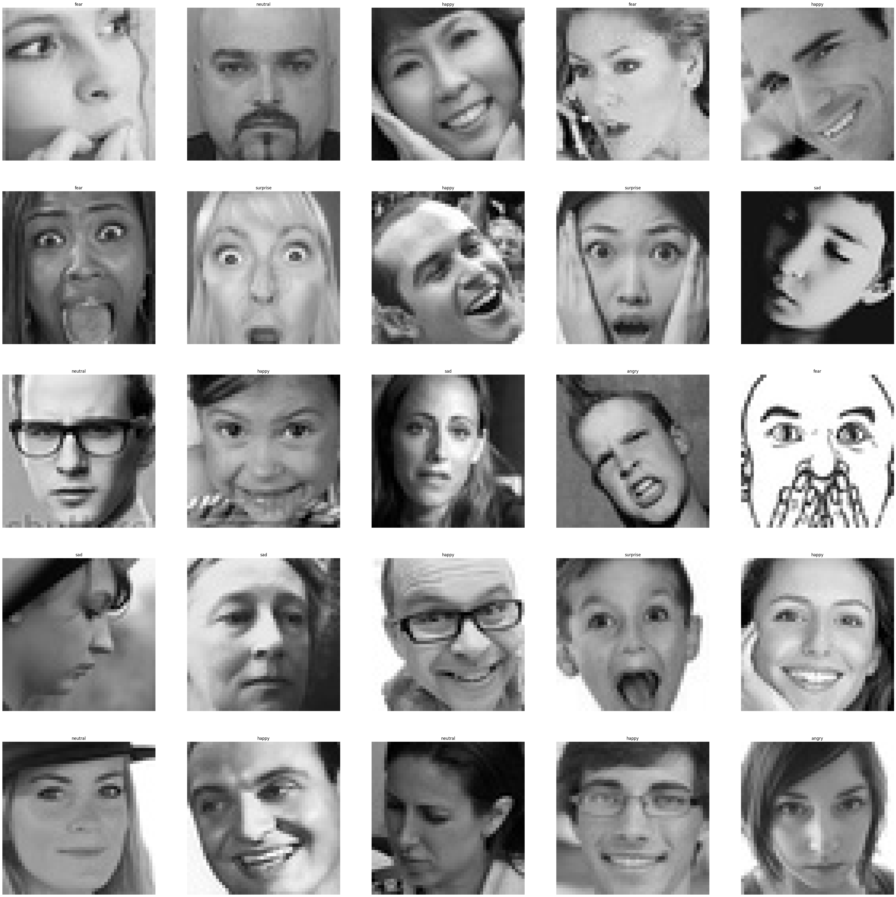
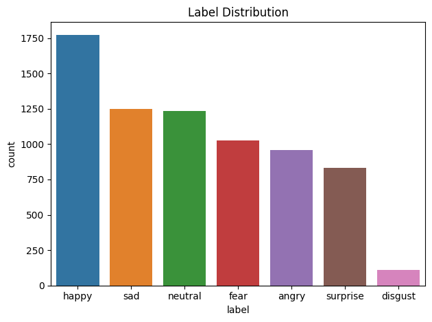
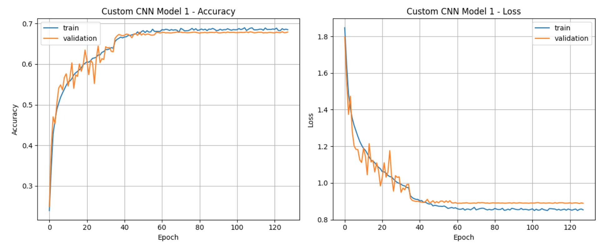
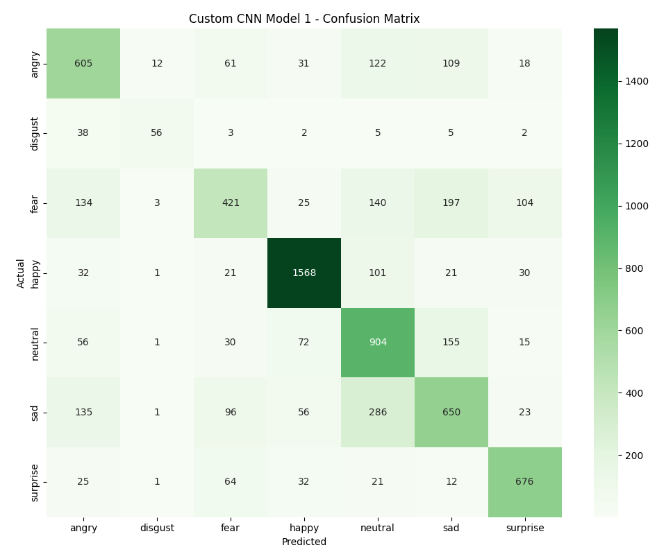
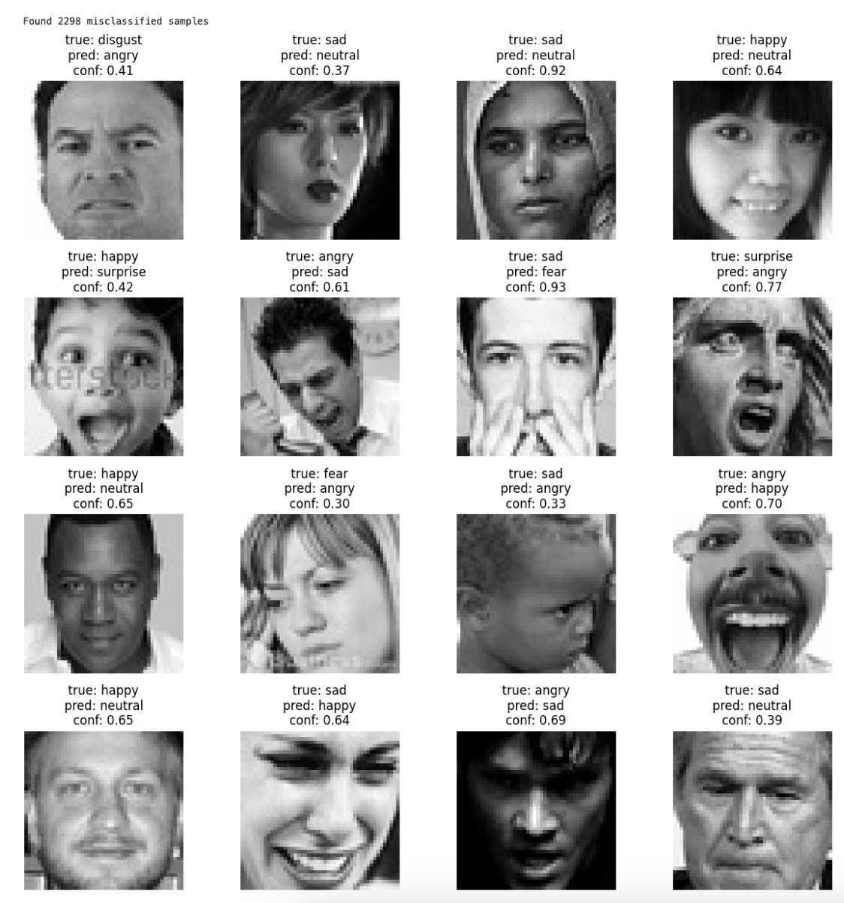
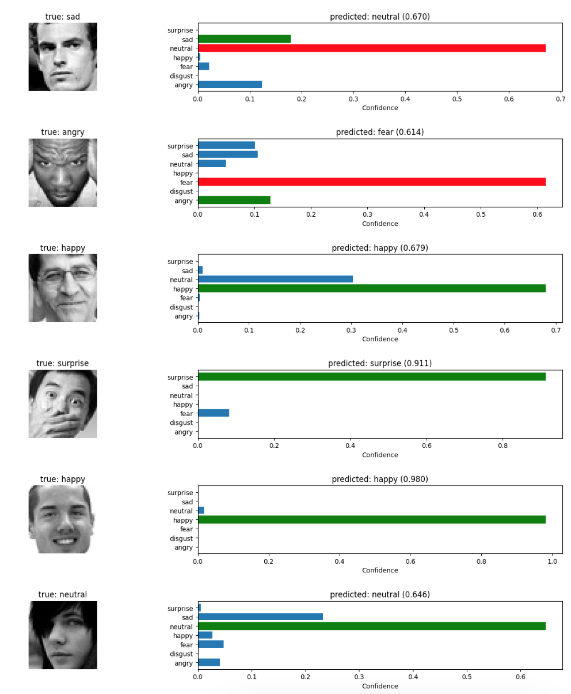
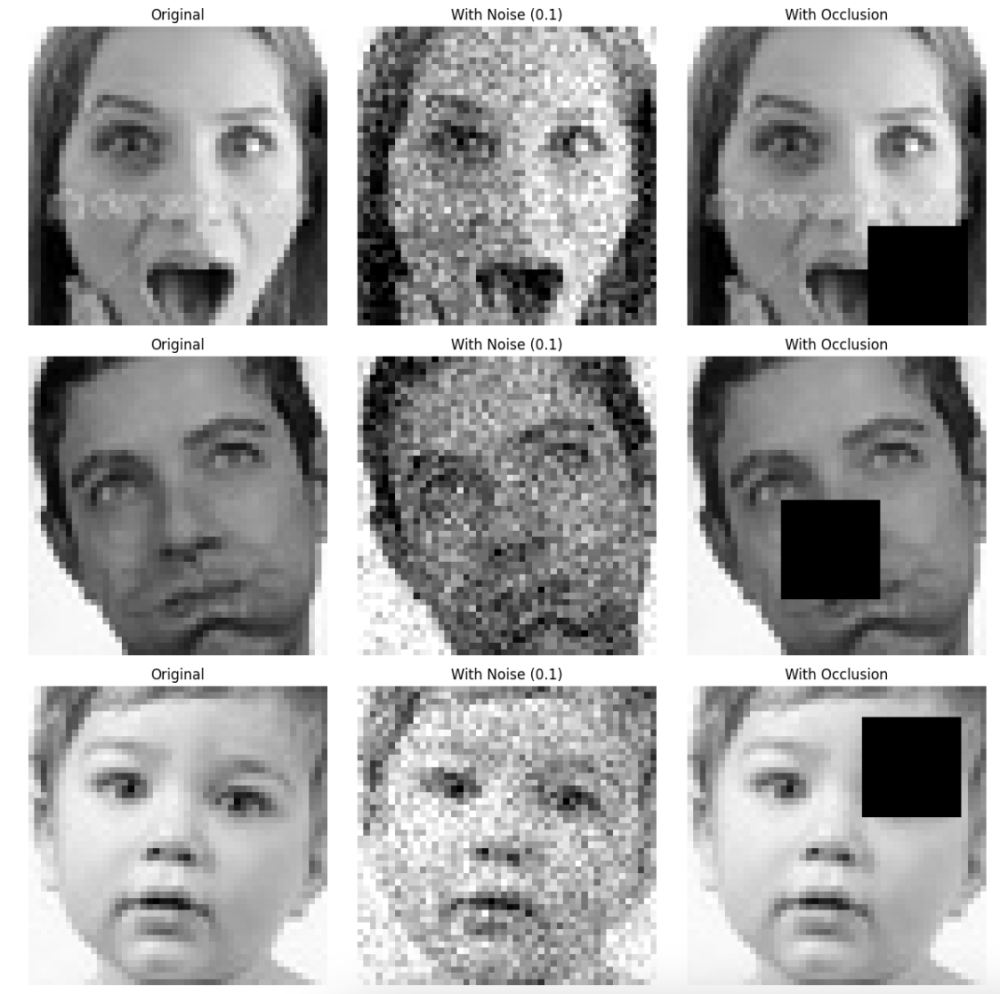

# Recognition of Facial Emotions via CNN

## Project Description

This project implements a Convolutional Neural Network (CNN) for facial emotion recognition, classifying facial expressions into seven distinct categories: angry, disgust, fear, happy, neutral, sad, and surprise. The model processes 48x48 grayscale images and achieves 67.99% validation accuracy with regularization techniques to mitigate overfitting. This project was developed as part of computational mathematics studies, emphasizing the mathematical foundations underlying deep learning algorithms and neural network architectures.

## Table of Contents
- [Installation](#installation)
- [Usage](#usage)
- [Features](#features)
- [Methodology](#methodology)
- [Results](#results)
- [References](#references)
- [Dependencies](#dependencies)
- [Algorithms/Mathematical Concepts Used](#algorithmsmathematical-concepts-used)
- [License](#license)
- [Acknowledgments](#acknowledgments)
- [Data Source](#data-source)
- [Note](#note)

---

## Installation

1. Install required dependencies:
```bash
pip install -r requirements.txt
```

2. The requirements.txt must include:
```
- TensorFlow >= 2.8.0
- Keras >= 2.8.0
- NumPy >= 1.21.0
- Matplotlib >= 3.5.0
- Seaborn >= 0.11.0
- Scikit-learn >= 1.0.0
- OpenCV >= 4.5.0
- Pandas >= 1.3.0
- Pillow>=8.0.0
```

3. Download the dataset used in this project from [Kaggle](https://www.kaggle.com/datasets/aadityasinghal/facial-expression-dataset).

## Usage

### Evaluating the Model
```python
python evaluate_model.py --model_path model.keras
```

### Making Predictions
```python
from model import load_model, predict_emotion
model = load_model('model.keras')
prediction = predict_emotion(model, 'path/to/image.jpg')
```

## Features

- **Multi-class Classification**: Recognizes 7 distinct facial emotions
- **Robust Architecture**: 4-layer CNN with batch normalization and dropout regularization
- **Data Augmentation**: Real-time image augmentation during training
- **Comprehensive Evaluation**: Includes confusion matrix, classification report, and robustness testing
- **Callback Integration**: Early stopping, learning rate scheduling, and model checkpointing
- **Visualization Tools**: Training curves, prediction analysis, and error visualization

## Methodology

### 1. Data Preprocessing
- Image resizing to 48x48 pixels
- Grayscale conversion and normalization
- One-hot encoding for 7 emotion classes
- Train/test split: 28,709 training, 7,178 testing samples

### 2. Data Augmentation
- Rotation: ±15 degrees
- Translation: 10% width/height shift
- Shearing and zooming: 10% range
- Horizontal flipping

### 3. Model Architecture
```
Conv2D(64, 3x3) → BatchNorm → ReLU → MaxPool → Dropout(0.2)
Conv2D(128, 5x5) → BatchNorm → ReLU → MaxPool → Dropout(0.25)
Conv2D(256, 3x3) → BatchNorm → ReLU → MaxPool → Dropout(0.25)
Conv2D(512, 5x5) → BatchNorm → ReLU → MaxPool → Dropout(0.25)
Flatten
Dense(512) → BatchNorm → ReLU → Dropout(0.2)
Dense(256) → BatchNorm → ReLU → Dropout(0.25)
Dense(128) → BatchNorm → ReLU → Dropout(0.25)
Dense(64) → BatchNorm → ReLU → Dropout(0.25)
Dense(7) → Softmax
```

### 4. Training Configuration
- Optimizer: Adam (learning_rate=0.001)
- Loss: Categorical crossentropy
- Batch size: 32
- Maximum epochs: 128
- Early stopping patience: 32 epochs

### 5. Model Evaluation
- Test accuracy: 67.99%
- Weighted precision: 68.04%
- Weighted recall: 67.99%
- Weighted F1-score: 67.51%
- Average inference time: 0.0068s per sample

| *Sample Images in Dataset* |
|:--:| 
|  |

| *Distribution of Training Images* |
|:--:| 
|  |

| *Distribution of Testing Images* |
|:--:| 
|  |

## Results

### Training and Testing Loss and Accuracy Analysis

| *Loss and Accuracy Curve for Training and Testing Data* |
|:--:| 
|  |

### Error Analysis

The model shows 2,298 misclassified samples out of 7,178 test samples, with particular challenges in distinguishing between similar emotions like fear/surprise and sad/neutral.

| *Confusion Matrix* |
|:--:| 
|  |

| *Misclassified Sample Images* |
|:--:| 
|  |

| *True versus Predicted Result of Sample Images* |
|:--:| 
|  |

### Robustness Testing
- Clean data accuracy: 67.99%
- Noise level 0.05: 34.0%
- Noise level 0.1: 17.6%
- Noise level 0.2: 17.4%

| *Robustness Testing* |
|:--:| 
|  |

## Dependencies

- TensorFlow >= 2.8.0
- Keras >= 2.8.0
- NumPy >= 1.21.0
- Matplotlib >= 3.5.0
- Seaborn >= 0.11.0
- Scikit-learn >= 1.0.0
- OpenCV >= 4.5.0
- Pandas >= 1.3.0

## Algorithms/Mathematical Concepts Used

## 1. Convolutional Neural Networks (CNNs)
- **Convolution Operation**: Extracts features using learnable filters.
- **Mathematical Formulation**:  
  $$(f * g)(t) = \int f(\tau)g(t-\tau)d\tau$$
- **Activation Functions**: ReLU introduces non-linearity.

## 2. Batch Normalization
- **Normalization**:  
  $$\hat{x} = \frac{x - \mu}{\sqrt{\sigma^2 + \epsilon}}$$
- **Scale and Shift**:  
  $$y = \gamma \hat{x} + \beta$$
- Reduces internal covariate shift.

## 3. Dropout Regularization  
**Mechanism:** Deactivates neurons with probability $p_{\text{keep}}$ = 1 - dropout_rate. Prevents overfitting by reducing neuron co-adaptation.

## 4. Adam Optimization
- **Momentum**:  
  $$m_t = \beta_1 m_{t-1} + (1 - \beta_1)g_t$$
- **RMSprop**:  
  $$v_t = \beta_2 v_{t-1} + (1 - \beta_2)g_t^2$$
- **Parameter Update**:  
  $$\theta = \theta - \alpha \frac{\hat{m}_t}{\sqrt{\hat{v}_t} + \epsilon}$$

## 5. Categorical Cross-Entropy Loss
- **Loss Function**:  
  $$L = -\sum_i y_i \log(\hat{y}_i)$$
- Suitable for mutually exclusive class predictions.

## 6. Data Augmentation Transforms
- **Rotation Matrices**: Geometric transformations preserving image content.
- **Affine Transformations**: Linear mapping + translation.

## References

1. Goodfellow, I., Bengio, Y., & Courville, A. (2016). *Deep Learning*. MIT Press.
2. Lecun, Y., Bottou, L., Bengio, Y., & Haffner, P. (1998). Gradient-based learning applied to document recognition. *Proceedings of the IEEE*, 86(11), 2278-2324.
3. Ioffe, S., & Szegedy, C. (2015). Batch normalization: Accelerating deep network training by reducing internal covariate shift. *arXiv preprint arXiv:1502.03167*.
4. Srivastava, N., Hinton, G., Krizhevsky, A., Sutskever, I., & Salakhutdinov, R. (2014). Dropout: a simple way to prevent neural networks from overfitting. *The journal of machine learning research*, 15(1), 1929-1958.

## Data Source

Dataset: [Facial Expression Dataset](https://www.kaggle.com/datasets/aadityasinghal/facial-expression-dataset)
- **Classes**: 7 emotions (angry, disgust, fear, happy, neutral, sad, surprise)
- **Format**: 48x48 grayscale images
- **Size**: 35,887 total images
- **Split**: 28,709 training, 7,178 testing

## License

This project is licensed under the MIT License - see the [LICENSE](LICENSE) file for details.

## Acknowledgments

- Kaggle community for providing the facial expression dataset
- TensorFlow/Keras development team for the deep learning framework
- Research community for foundational work in computer vision and emotion recognition
- Academic advisors and peers for guidance and feedback

## Note

| AI was used to generate most of the docstrings and inline comments in the code. |
|:--:|
